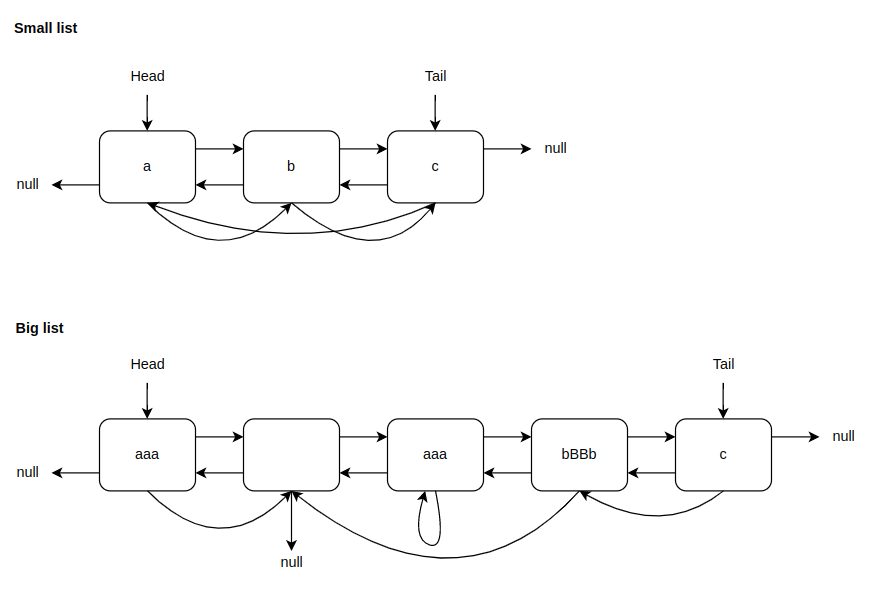

# SingleProjects

## General info
В этом проекте созданы интерфейсы ISerializable и IListRandom, а также две реализации с разными подходами к сериализации. Binary - где данные переводятся в двоичный формат, и Readable - запись в формате, удобном для чтения. 

Для проверки написаны юнит-тесты для методов Serialize и Deserialize, а также в Program есть вывод списков на консоль до и после манипуляций. 

В качестве примеров используются три листа: EmptyList, SmallList и BigList. Схемы второго и третьего можно увидеть на изображении ниже.

